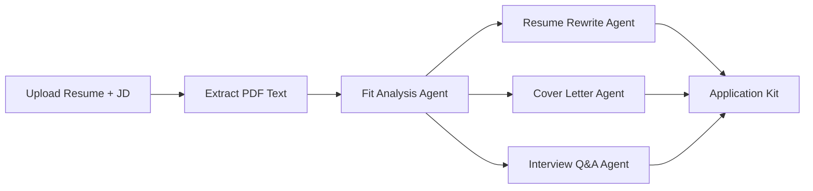

# Co-Pilot — Job Application Intelligence


Co-Pilot is an AI-powered job application assistant. Upload your resume, paste a job description, and four specialized AI agents generate a complete application kit — fit analysis, tailored resume rewrite, cover letter, and interview prep — in under 60 seconds.

Built with **FastAPI** (Python) and a vanilla **HTML/CSS/JS** frontend. No React, no Node.js required.

---

## Table of Contents

- [Features](#features)
- [How It Works](#how-it-works)
- [Tech Stack](#tech-stack)
- [Project Structure](#project-structure)
- [Prerequisites](#prerequisites)
- [Installation](#installation)
- [Running the App](#running-the-app)
- [Usage Guide](#usage-guide)
- [Customizing Logos & Icons](#customizing-logos--icons)
- [API Reference](#api-reference)
- [Troubleshooting](#troubleshooting)
- [Security Notes](#security-notes)
- [Contributing](#contributing)
- [Author](#author)

---

## Features

- **User accounts** — Register, sign in, and manage applications with JWT authentication
- **Fit Analysis** — Match score, strengths, gaps, and missing keywords
- **Resume Rewrite** — Tailored bullets and keywords without inventing experience
- **Cover Letter** — Human-sounding, role-specific 3-paragraph letter
- **Interview Prep** — 10 Q&A pairs grounded in your resume (STAR method)
- **Live pipeline progress** — Loading screen shows which agent is running in real time
- **Application tracker** — Sidebar to view, update status, and delete past applications
- **Custom branding** — Replace default SVG logos/icons in `frontend/assets/`
- **Pipeline resume** — If the page reloads mid-run, the app reconnects and keeps polling until agents finish

---

## How It Works

When you click **Run AI Pipeline**:

1. Text is extracted from your uploaded PDF resume
2. The job application is saved to a SQLite database
3. Four Groq-powered agents run **sequentially** in the background
4. The frontend polls for progress and shows results when all agents finish

| Step | Agent | Output | Depends on |
|------|-------|--------|------------|
| 1 | Fit Analyst | Match score, gaps, keywords | Resume + JD |
| 2 | Resume Rewriter | Tailored resume | Resume + JD + Fit Analysis |
| 3 | Cover Letter Writer | Personalized cover letter | Resume + JD + Fit Analysis |
| 4 | Interview Coach | 10 interview Q&As | Resume + JD |



**Model used:** `llama-3.3-70b-versatile` via the [Groq API](https://console.groq.com/)

---

## Tech Stack

| Layer | Technology |
|-------|------------|
| Backend | FastAPI, Uvicorn |
| Database | SQLite + SQLAlchemy |
| AI | Groq API |
| Auth | JWT (python-jose), bcrypt (passlib) |
| PDF parsing | PyMuPDF |
| Frontend | HTML, CSS, JavaScript (no framework) |

---

## Project Structure

```
job-copilot/
├── backend/
│   ├── main.py              # FastAPI routes & app entry point
│   ├── agents.py            # Four AI agents + pipeline orchestrator
│   ├── auth.py              # JWT authentication
│   ├── database.py          # SQLite setup (data/ folder)
│   ├── models.py            # SQLAlchemy models (User, Role, Draft)
│   ├── schemas.py           # Pydantic request/response schemas
│   ├── pipeline_state.py    # In-memory progress tracking for polling
│   ├── requirements.txt     # Python dependencies
│   └── .env                 # Secrets — create this locally (not committed)
├── frontend/
│   ├── index.html           # App UI
│   ├── app.js               # Frontend logic
│   ├── style.css            # Styles
│   └── assets/              # Logo & agent icons (SVG)
├── .gitignore
└── README.md
```

**Runtime data** (created automatically, not committed to Git):

```
backend/data/
├── jobcopilot.db            # SQLite database
└── uploads/                 # Uploaded resume PDFs
```

---

## Prerequisites

- **Python 3.11+**
- A free **[Groq API key](https://console.groq.com/)**
- Git (for cloning)

---

## Installation

### 1. Clone the repository

```bash
git clone https://github.com/Veznto/job-copilot.git
cd job-copilot
```

### 2. Create a virtual environment & install dependencies

**Windows (PowerShell):**

```powershell
cd backend
python -m venv venv
venv\Scripts\activate
pip install -r requirements.txt
```

**macOS / Linux:**

```bash
cd backend
python3 -m venv venv
source venv/bin/activate
pip install -r requirements.txt
```

### 3. Configure environment variables

Create a file named `.env` inside the `backend/` folder:

```env
# Groq — get your key at https://console.groq.com/
GROQ_API_KEY=your_groq_api_key_here

# JWT auth — use a long random string in production
SECRET_KEY=your_super_secret_key_change_this_in_production
ALGORITHM=HS256
ACCESS_TOKEN_EXPIRE_MINUTES=1440
```

| Variable | Required | Description |
|----------|----------|-------------|
| `GROQ_API_KEY` | Yes | Your Groq API key for running AI agents |
| `SECRET_KEY` | Yes | Secret used to sign JWT tokens |
| `ALGORITHM` | Yes | JWT algorithm (use `HS256`) |
| `ACCESS_TOKEN_EXPIRE_MINUTES` | Yes | How long login sessions last |

> **Never commit your `.env` file.** It is listed in `.gitignore`.

---

## Running the App

From the `backend/` folder with your virtual environment activated:

```bash
uvicorn main:app --reload
```

Open the app in your browser:

```
http://127.0.0.1:8000/
```

The backend serves **both the API and the frontend** from this URL. You do not need Live Server or a separate frontend server.

### API docs (optional)

FastAPI auto-generates interactive docs:

- **Swagger UI:** http://127.0.0.1:8000/docs
- **ReDoc:** http://127.0.0.1:8000/redoc

---

## Usage Guide

1. **Create an account** or sign in
2. Click **+ New Application**
3. Fill in **Job Title**, **Company**, and paste the **Job Description**
4. Upload your **resume as a PDF**
5. Click **Run AI Pipeline →**
6. Stay on the loading screen while each agent runs (typically 30–60 seconds)
7. Review results across four tabs:
   - Fit Analysis
   - Resume (rewritten vs. original)
   - Cover Letter
   - Interview Prep
8. Use **Copy** to grab any section
9. Update application **status**: Applied, Interviewing, Offer, Rejected

Past applications appear in the sidebar — click any entry to reopen its results.

---

## Customizing Logos & Icons

All visual assets live in `frontend/assets/`:

| File | Used for |
|------|----------|
| `logo.svg` | App brand mark (auth, sidebar, welcome, loading) |
| `icon-fit.svg` | Fit Analysis |
| `icon-resume.svg` | Resume Rewrite |
| `icon-cover.svg` | Cover Letter |
| `icon-interview.svg` | Interview Prep |
| `icon-upload.svg` | File upload zone |

**To swap icons:** replace any SVG file with your own (keep the same filename), or update the `` paths in `frontend/index.html`.

**Recommended sizes:**

- Brand logo: **64×64 px**
- Agent icons: **24–28 px**
- Tab icons: **16 px**

---

## API Reference

| Method | Endpoint | Auth | Description |
|--------|----------|------|-------------|
| `POST` | `/auth/register` | No | Create a new account |
| `POST` | `/auth/login` | No | Sign in (returns JWT) |
| `POST` | `/applications/start` | Yes | Start AI pipeline (returns `role_id` immediately) |
| `GET` | `/applications/{id}/pipeline-status` | Yes | Poll agent progress |
| `GET` | `/applications` | Yes | List all applications |
| `GET` | `/applications/{id}` | Yes | Get one application with drafts |
| `PATCH` | `/applications/{id}` | Yes | Update application status |
| `DELETE` | `/applications/{id}` | Yes | Delete an application |

All protected routes require a Bearer token:

```
Authorization: Bearer <your_jwt_token>
```

---

## Troubleshooting

### Loading screen disappears immediately / lands on welcome page

- Open the app at **`http://127.0.0.1:8000/`** — not via Live Server or by double-clicking `index.html`
- Live Server auto-reloads when the database or uploads change, which resets the UI mid-pipeline
- Hard refresh after code changes: **Ctrl+Shift+R** (Windows) or **Cmd+Shift+R** (Mac)

### `GROQ_API_KEY` or pipeline errors

- Confirm your `.env` file is in the `backend/` folder (same directory as `main.py`)
- Verify your Groq API key at [console.groq.com](https://console.groq.com/)
- Restart the server after editing `.env`

### Backend won't start

- Activate the virtual environment before running `uvicorn`
- Run `pip install -r requirements.txt` from the `backend/` folder
- Run `uvicorn main:app --reload` from the `backend/` directory

### PDF upload fails

- Only **PDF** files are supported
- The PDF must contain selectable text (image-only scanned PDFs may not work)

### Results show "No data yet"

- Wait for all four agents to finish before opening the application
- Check the backend terminal for error messages from the Groq API

---

## Security Notes

This project is intended for **local development and personal use**. Before deploying publicly:

- Change `SECRET_KEY` to a strong random value
- Restrict CORS in `backend/main.py` to your domain (currently set to `*`)
- Use HTTPS and a production database (e.g. PostgreSQL)
- Never expose your Groq API key in the frontend or commit it to Git
- If you accidentally pushed secrets to GitHub, **rotate your API keys immediately**

---

## Contributing

Contributions are welcome! To contribute:

1. Fork the repository
2. Create a feature branch: `git checkout -b feature/my-feature`
3. Commit your changes: `git commit -m "Add my feature"`
4. Push to the branch: `git push origin feature/my-feature`
5. Open a Pull Request

Please keep changes focused and match the existing code style.

---

## Author

**Harsh Choudhary**

- GitHub: [@Veznto](https://github.com/Veznto)

If this project helped you, consider giving it a star on GitHub.

---

## Acknowledgements

- [Groq](https://groq.com/) for fast LLM inference
- [FastAPI](https://fastapi.tiangolo.com/) for the backend framework
- [PyMuPDF](https://pymupdf.readthedocs.io/) for PDF text extraction
